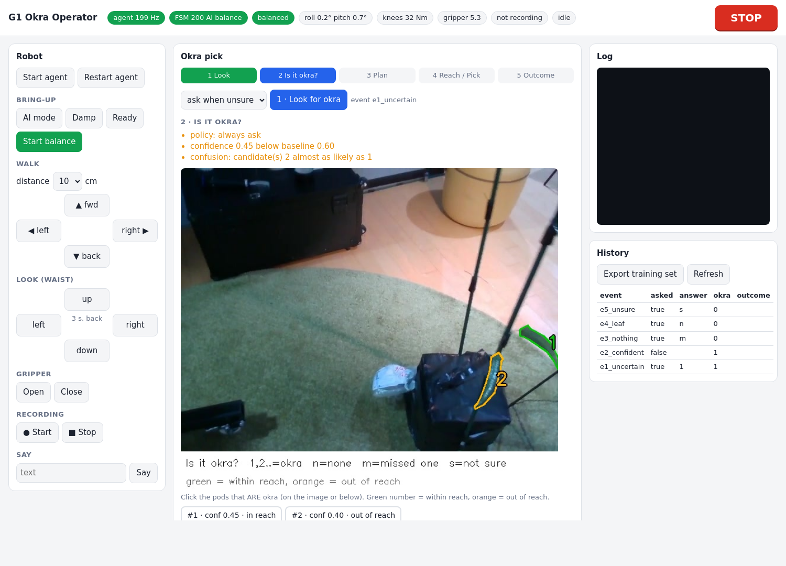
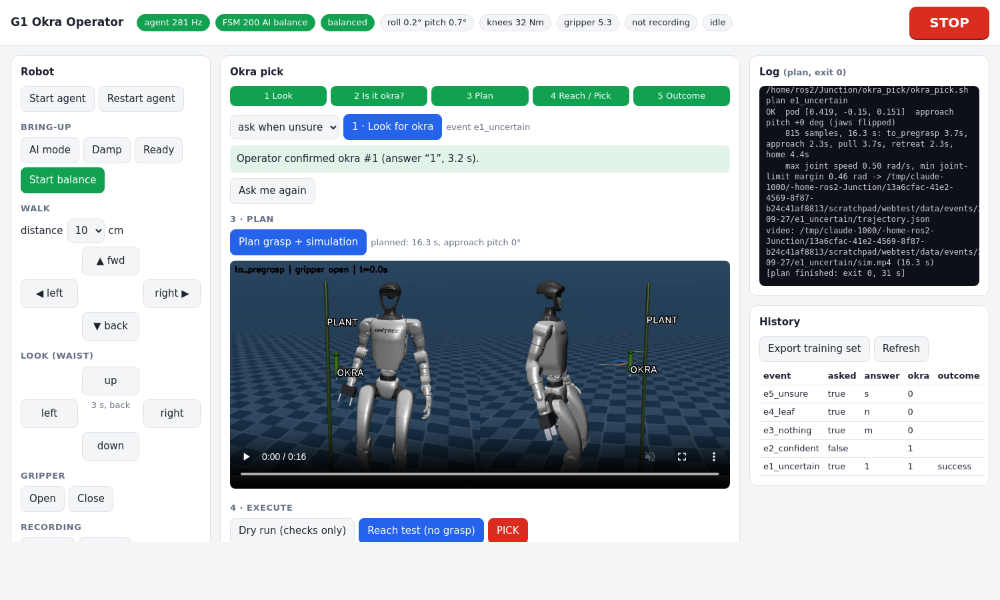

# 13 — Human-in-the-loop okra confirmation and the `okra_data/` store

The robot does not pick on its own judgement when it is unsure: it asks the operator, and every answer
is kept as training data for the detector. Built and tested offline 2026-09-27 (not yet on hardware).

## Operator web interface (main way to use it)

```bash
cd ~/Junction/okra_pick && ./okra_pick.sh web        # then open http://localhost:8080 on the VM
./okra_pick.sh web --host 0.0.0.0 --token SECRET     # from a tablet/laptop: http://<vm-ip>:8080/?token=SECRET
```
Add `&operator=NAME` to the URL (or type it once when asked): the name is stored with every answer.

| Area | What it does |
|---|---|
| top bar | live robot state (agent Hz, FSM, balanced?, tilt, knee load, gripper, recording, busy) + **STOP** (also **Esc**) |
| Robot (left) | start/restart agent, AI mode / Damp / Ready / Start balance (each asks first), walk ◀▶▲▼ by 5–40 cm, look left/right/up/down, gripper, recording, say |
| Okra pick (centre) | steps **1 Look → 2 Is it okra? → 3 Plan → 4 Reach/Pick → 5 Outcome** |
| step 2 | the frame with numbered candidates and the reasons it asks; **click the pods that are okra** (image or chips), then *Selected are okra* / *None is okra* / *It missed an okra* / *Not sure* |
| step 3 | plans the grasp and plays the MuJoCo simulation video inline |
| step 4 | Dry run, Reach test, PICK (you must type REACH / PICK); recording starts automatically |
| Log / History (right) | live output of the running step; past events (click to open); *Export training set* |




Server: `okra_pick/web/server.py` (standard library; talks to robot_agent over TCP, runs okra_pick.sh steps as
background jobs, serves okra_data files). Listens on localhost only unless given `--host` **and** `--token`.
Only the listed robot commands are forwarded (no zero-torque from the web).

Tested 2026-09-27 against the simulated agent: state 4 Hz, step through the web, `zero` refused, pending
question shown with clickable candidates, answer "1" → target, plan job → 16.3 s plan + sim video, outcome
saved, PICK without the typed word refused, `/data/../` path traversal blocked.

## Flow

```
web "Look for okra" (or okra_pick.sh perceive in a terminal)
 1 ROBOT  okra_perceive.py  15 frames -> detector (confidence floor 0.10, filter rejections kept)
                            -> candidates.py merges sightings -> evidence bundle
 2 VM     rsync bundle -> okra_data/events/<day>/<EVENT>/
 3 VM     hitl/decide.py    AUTO (confident) | ASK (unsure) | NONE
 4 VM     hitl/confirm.py   if ASK: numbered image + robot says the question + LED amber
                            operator: "1" / "1,3" / n / m / s / q  -> decision.json (+ target.json)
 5        plan / reach / pick as before, on the confirmed target (Guide 11)
 6 VM     hitl/outcome.py   after pick: did it work? -> outcome.json
 7 VM     hitl/export_dataset.py -> okra_data/datasets/hitl_vNNN (YOLO-seg) ; missed -> to_annotate/ (CVAT)
```

## When does it ask? (`okra_pick/hitl/hitl_config.py`)

`MODE = "uncertain"` (default): acts alone only if the best candidate has **all** of

| Check | Default |
|---|---|
| median confidence ≥ `BASELINE_CONF` | 0.60 |
| no other candidate within `CONFUSION_GAP` of it | 0.15 |
| seen in ≥ `MIN_SEEN_FRAC` of the frames | 60 % |
| sanity filter accepted it in ≥ `MIN_FILTER_OK` of sightings | 80 % |
| 3D position spread ≤ `MAX_SPREAD_M` | 1.5 cm |
| has depth and is inside the arm's reach | — |

Otherwise it asks and records **why** (e.g. "confidence 0.45 below baseline 0.60; confusion: candidate 2
almost as likely as 1"). With no candidate at all it asks "did I miss one?" (`ASK_WHEN_NOTHING`), which is
how detector misses are found. `MODE = "always"` asks every time (recommended for the first sessions);
`"never"` never asks (acts only when confident). Candidates below `SHOW_FLOOR` (0.15) are not shown.

## The operator's answers

| Key | Meaning | Stored as | Training use |
|---|---|---|---|
| `1`, `1,3` | these are okra, the other shown ones are not | okra / not_okra | polygons of the okra |
| `n` | none of the shown is okra | not_okra | hard negative (empty label) |
| `m` | there is an okra it did not mark | missed | frame → `to_annotate/` → CVAT |
| `s` | not sure | unsure | skipped |
| `q` | abort | aborted | skipped |

The target is the first confirmed okra that is in reach; a confirmed okra out of reach gives no target
("move the robot closer"). Robot feedback (via robot_agent, best effort): LED amber while asking, green
for yes / red for no, and short spoken sentences (`SAY_*`; TTS voice id `SPEAKER_ID` in agent.py: CALIBRATE).

## Data structure

See `okra_data/README.md` for every file. Per event: all frames, depth, every candidate with statistics
and masks, robot state + camera calibration, the question image, the decision with reasons and response
time, target, trajectory, execution log, outcome. `okra_data/index.csv` = one row per event
(`python okra_pick/hitl/store.py list`). Heavy folders are git-ignored; README and index are tracked.

## Terminal commands (same flow without the web page)

```bash
cd ~/Junction/okra_pick
./okra_pick.sh perceive                 # look + ask if unsure
./okra_pick.sh perceive --mode always   # always ask (first sessions)
./okra_pick.sh confirm [EVENT]          # ask again for an event (e.g. after a wrong key)
./okra_pick.sh outcome [EVENT]          # record the result (asked automatically after pick)
./okra_pick.sh dataset [--include-auto] # export training set
python hitl/store.py list 20            # recent events
```
Operator name: `OKRA_OPERATOR=name ./okra_pick.sh perceive` (default: login name).

## Offline test (`okra_pick/tests/test_hitl.py`, 2026-09-27) — 8/8 pass

Real session02 frames + the team's CVAT polygons as fake detections, temporary `OKRA_DATA`,
simulated robot_agent for voice/LED:

| Scenario | Result |
|---|---|
| two similar low-confidence pods, answer `1` | asked (below baseline + confusion); 1 = okra, 2 = not_okra; target 1 |
| one confident, stable, in-reach pod | AUTO, not asked |
| nothing detected, answer `m` | asked "did I miss one"; frame → to_annotate |
| answer `n` | hard negative, no target |
| answer `s` | skipped |
| export | 1 positive (1 polygon), 1 negative, 1 to_annotate; unsure + auto skipped |
| robot voice / LED | 8 say + 8 led commands reached the agent |
| index.csv | 5 events |

## Tuning later

Plot `top_conf` against the operator's answers in `index.csv`: raise `BASELINE_CONF` if confident
detections were rejected by the operator, lower it if it keeps asking about obvious pods.
