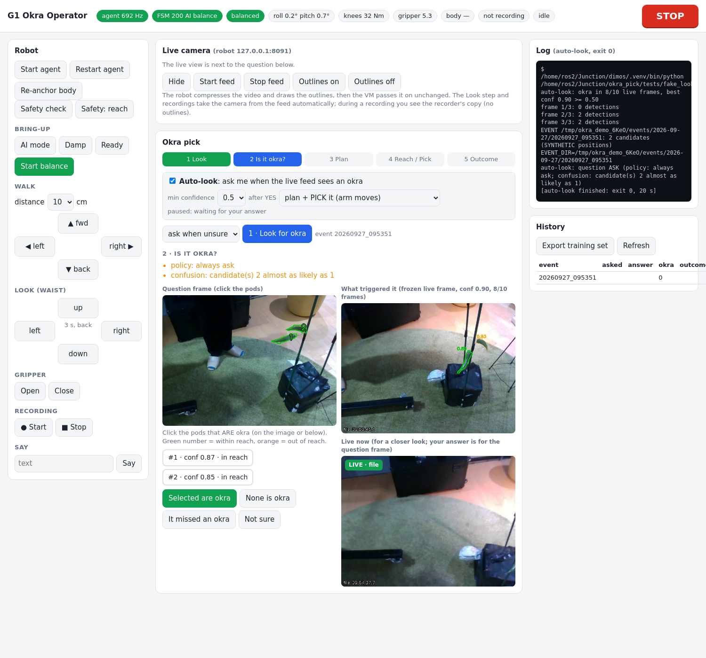

# 17 — Live camera feed and auto-look in the operator web page

Written 2026-09-27. Tested offline only (recorded robot video, simulated agent): `tests/test_live.py` 6/6.
**Not yet run on the robot.** Read with 13 (web UI), 16 (run day), 04/07 (recorder and its preview).

## What it is

The web page (`./okra_pick.sh web`) shows the head camera live, so the operator can look at the pod
while answering "Is it okra?". While a question is open, the live view moves next to the question frame:



The answer always refers to the **question frame** (numbered candidates). The live view is for a closer
look (angle, lighting, leaves in front). Its outlines have no numbers because they come from a different frame.

## Auto-look: one okra at a time, always asked

Turn on **Auto-look** in the Okra pick card. The loop, per okra:

1. The robot's live detector sees a filter-accepted okra with conf ≥ **min confidence** (default 0.5) in 6 of
   the last 10 frames (~1 s at 10 fps). A lone flicker never triggers.
2. It keeps the clean snapshot (`trigger.jpg`) and the outlined one (`trigger_live.jpg`), plus `trigger.json`
   in the event, then runs the normal **Look** (15 frames + depth, so the 3D position is known).
3. It **always asks** (beep, tab title "❓ Is it okra?", robot voice/LED). The page shows three images: the
   **question frame** (numbered pods, answer buttons right under it), **what triggered it** (the frozen live
   frame, with its confidence), and **live now**. All three refresh for every new okra.
4. On **Selected are okra**, it does the **after YES** work for THAT okra: `plan + PICK` (default), `plan + reach test`,
   `plan only` or `nothing`. For reach/pick, that click opens an "ARM WILL MOVE" dialog. OK there is the
   go-ahead for this okra only. Cancel returns to the question. A YES that arrives without that confirmation only plans.
   Every step still runs `okra_pick.sh`'s live safety gate (16), and a FAIL stops the chain.
5. After the pick, answer **Did it pick the okra?**, or use **Skip this okra → next** if the plan failed or you
   don't want it. Only then does auto-look look for the next okra (20 s cooldown).

Auto-look waits while a job runs, a question is open, a confirmed okra has no outcome yet, the robot is
busy, a recording runs, or during the cooldown. The page shows the reason. "None is okra", "not sure" and
"missed" start nothing; the next look comes after the cooldown. The same leaf can be asked about again.
**STOP** (Esc) cancels the chain (no further step starts) and **turns auto-look off**. Re-arm it by hand.

For the first robot run, use **after YES = plan + reach test** (16: pick only after reach looked right).

## Why it does not lag the VM

```
 Orin (robot)                                      VM                          browser
 head RealSense ─ ffmpeg V4L2 ─ live_cam.py ── TCP :8091 ──▶ server.py ── /api/live.mjpg ──▶ 
                 (640x480)      detector on GPU  MJPEG      only forwards bytes
                                draw + JPEG q70  ~40 KB/frame, 10 fps ≈ 0.4 MB/s
```

- All image work (decode, okra outlines on CUDA, JPEG) happens on the Orin. The VM decodes nothing:
  one upstream connection is shared by every viewer, and there is no upstream connection when nobody watches.
- TCP, not UDP: the IP fragment loss on the VM link (01) does not apply.
- Newest frame only, at every hop. A slow viewer skips frames, and delay never builds up.
- Measured on the VM (2026-09-27): 10 fps end to end, frame age ≈ 0.1 s, relay CPU negligible.
  The detector overlay only costs VM CPU in the offline test, where no GPU is available.

## Who owns the camera

Only one program can open the head camera. `live_cam.py` re-checks every 0.2 s:

| Situation | Feed source | Badge |
|---|---|---|
| recorder running (`~/g1_rec/recorder.pid` alive) | **relay**: decodes the recorder's local copy `udp://127.0.0.1:5601` (no outlines) | LIVE · relay |
| a hold file in `/tmp/okra_live_hold/` not expired | **paused**: camera released, grey "camera in use: look" card | camera in use by a step (orange) |
| otherwise | **camera**: ffmpeg V4L2 `/dev/video4` + outlines | LIVE · camera |

Holds (file name = who, content = expiry in robot epoch seconds, written with the robot's own `date`):
- `okra_pick.sh look` / `perceive`: `look`, 180 s; `floor`: 120 s. Removed on exit by a trap.
  They wait up to 3 s until the feed reports it has let go.
- `rec.sh start`: `record`, 30 s (covers only the hand-over; after that the running recorder decides).
  `rec.sh stop` removes it.
- A crashed step can't block the feed for long, because every hold expires on its own.

`recorder.py` got `--preview-local 127.0.0.1:5601` (default on). It is the same H.264 encode as the VM preview
(07), so the recording itself is unchanged. During reach/pick you therefore see the recorder's picture.

## Commands

```
okra_pick/okra_pick.sh deploy          # copies robot/live_cam.py too
okra_pick/okra_pick.sh live start      # stops videohub (free_camera), starts the feed on the Orin (log ~/okra_pick/live.log)
okra_pick/okra_pick.sh live status     # process, /status JSON, last log lines
okra_pick/okra_pick.sh live stop
```
The web page has the same controls in the **Live camera** card: Hide/Show (Hide closes the stream, so
no bytes cross the robot link), Start feed, Stop feed, and Outlines on/off
(green = passes the okra filter, orange = rejected, number = confidence).

Robot HTTP (robot network only, `--host 192.168.123.164`): `/live.mjpg`, `/snap.jpg`, `/status`,
`/control?overlay=0|1`. VM: `/api/live.mjpg`, `/api/live.jpg`, `POST /api/live {action}`, and `live` in
`/api/state` (connected, fps, age_s, source, error). `OKRA_LIVE=host:port` overrides the robot address.

## Badges: trust only a green LIVE

| Badge | Meaning | Do |
|---|---|---|
| green `LIVE · camera · 10 fps` | frames < 2 s old | fine |
| orange `camera in use by a step` | Look/floor/recorder hand-over | wait; it returns by itself |
| red `STALE n s old` | no new frame for > 2 s (link, robot, feed died) | **do not judge from it**; `live status` |
| red `no feed: …` | feed not started / robot off | `live start` |

Every frame also has the robot time burned in (bottom left), so a frozen picture is easy to spot.

## Test (VM, no robot)

```
cd okra_pick && ../dimos/.venv/bin/python tests/test_live.py       # feed, holds, relay (6 checks, ~40 s)
cd okra_pick && ../dimos/.venv/bin/python tests/test_autolook.py   # auto-look loop (5 checks, a few min)
```
Offline demo of the whole loop (nothing real runs; positions are SYNTHETIC):
`OKRA_LIVE=127.0.0.1:8091 OKRA_DATA=/tmp/demo OKRA_LOOK_CMD="<py> tests/fake_look.py" OKRA_PICK_SH=tests/fake_pick.sh`
plus `live_cam.py --file <clip>` and `agent.py --sim`. Never set `OKRA_LOOK_CMD` / `OKRA_PICK_SH` with the robot.
It covers the file source at ~10 fps, hold → paused → resume, recorder running → relay at 10 fps,
recorder stopped → camera (a missing device is reported), the web relay, and overlay control through the web.
It uses its own ports and hold directory.

## First run on the robot (to verify)

1. `okra_pick.sh deploy`, then `okra_pick.sh live start`. Expect `overlay detector okra_seg_s02.pt` in the log.
   If you see `No such file` or `busy`, check `/dev/video4` (05) and that videohub is stopped.
2. Web page: green LIVE badge; wave a hand and the delay should be well under 0.5 s.
3. `look`: the badge turns orange, the look runs normally, and the feed returns afterwards.
4. `rec.sh start x` / `stop`: LIVE · relay while recording, then LIVE · camera.
5. Check the Orin load during reach with the feed on (`top`): the player must stay at 50 Hz.
   If it doesn't, press **Outlines off**, or stop the feed during reach/pick.

Open points: `/dev/video4` for V4L2 colour is taken from the recorder (it worked there). The overlay model shares
the Orin GPU with `okra_perceive.py` (two small YOLO models, expected to fit).

## Step by step, recordings, record everything (2026-09-27)

- **Step by step** card: the selected okra's whole story: Look images + measured position → your answer → plan
  (simulation video) or **refused** (reason in plain words + `attempt_sim.mp4`: how far the arm gets, body collisions;
  made automatically, VM only, never sent to the robot) → motion → outcome → videos recorded around it.
- **Recordings** card: every `g1_record/data` episode: ▶ camera, ▶ replay (camera + simulation from the logged joints,
  `plan/replay_episode.py`), or "make replay".
- **record everything** (Recording section): keeps an `all_<time>` recording running; Look/floor pause it (the camera is
  exclusive) and it restarts right after; finished recordings are copied to the VM automatically. Reach/pick then use
  the running recording. **Not yet tested on the robot.** `?live=0` opens the page without the video stream.
