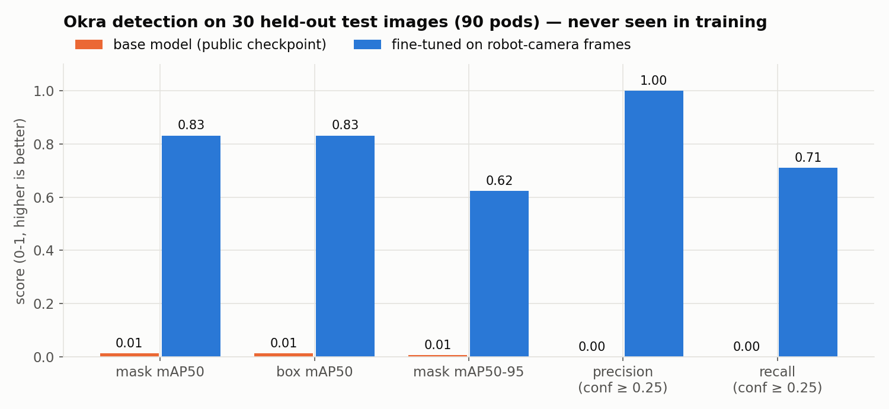
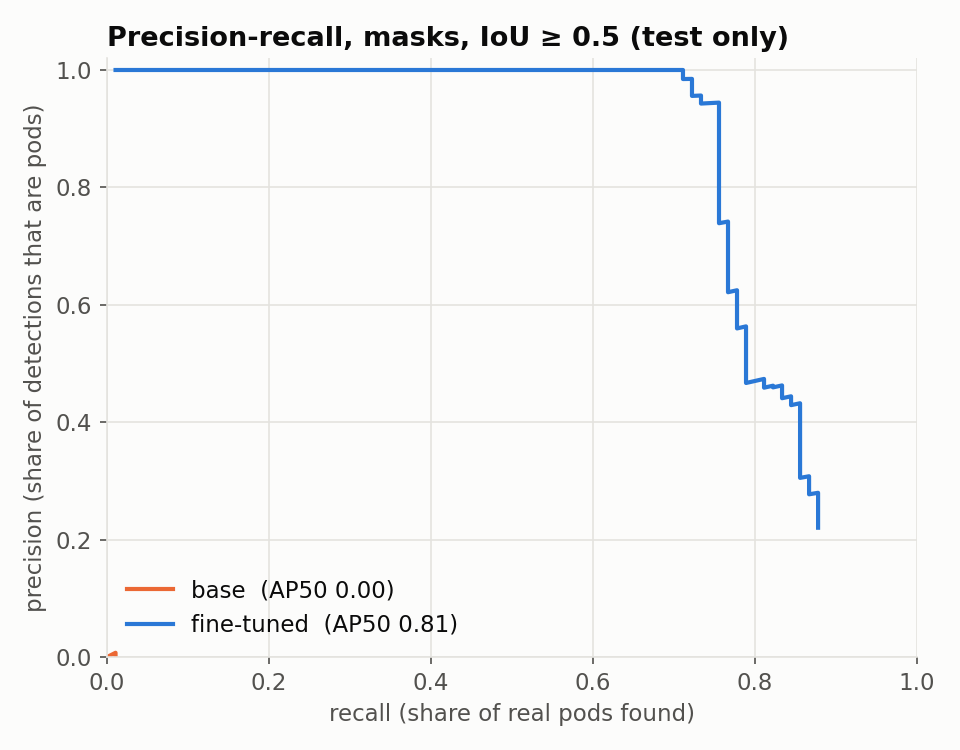
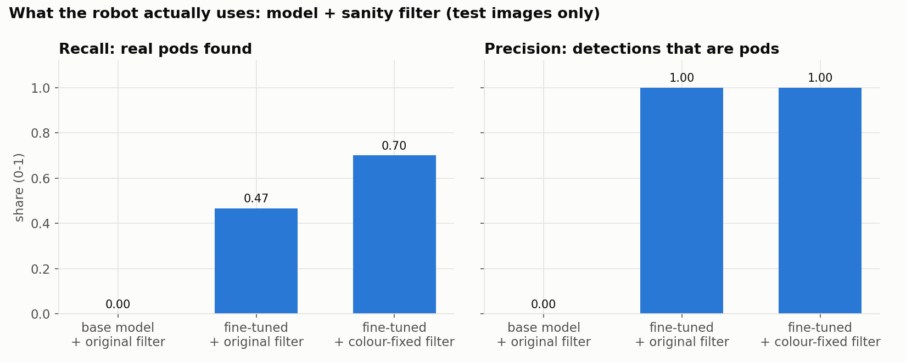
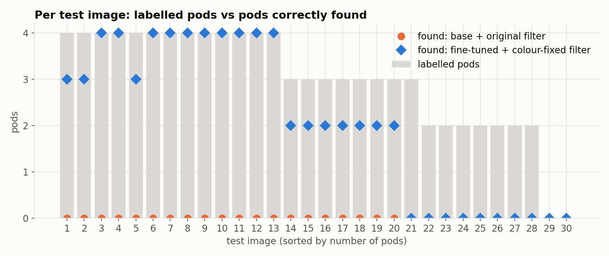
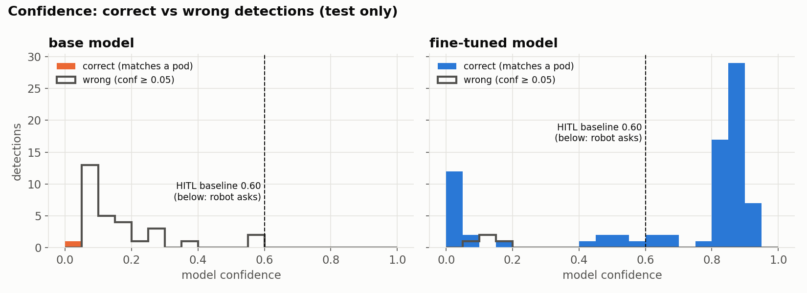
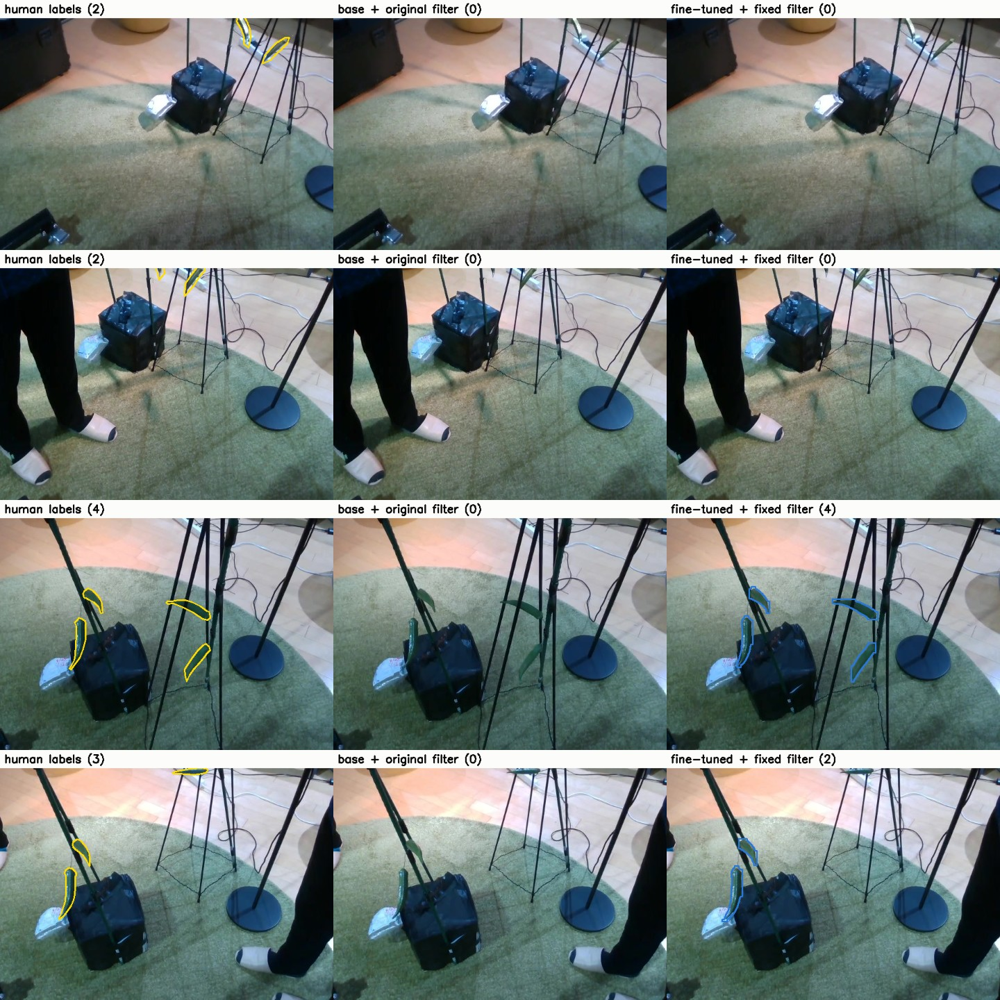

# Okra segmentation: base vs fine-tuned (held-out test split)

Generated 2026-09-27 by `evaluate_test.py`.

| | |
|---|---|
| Base model | `models/okra_seg.pt` (public checkpoint, YOLO11n-seg) |
| Fine-tuned model | `models/okra_seg_s02_3way.pt` (same architecture, fine-tuned on robot-camera frames) |
| Test split | `dataset/yolo_s02_3way/images/test`: **30 images, 90 labelled pods** |
| Train / val | 97 / 15 images. The test images were never used for training or for picking the checkpoint. |

Both networks have the same architecture (YOLO11n-seg, 2.83 M params, 9.6 GFLOPs), so any difference comes from the fine-tuning data.

## 1. Model only



| metric (test) | base | fine-tuned |
|---|---|---|
| mask mAP50 | 0.013 | **0.832** |
| mask mAP50-95 | 0.007 | **0.623** |
| box mAP50 | 0.013 | **0.832** |
| box mAP50-95 | 0.006 | **0.679** |
| precision @ conf 0.25 | 0.00 (0 TP / 6 FP) | **1.00** (64 TP / 0 FP) |
| recall @ conf 0.25 | 0.00 (0 / 90) | **0.71** (64 / 90) |

The base checkpoint does not work on this camera or scene. It finds none of the 90 pods, and the 6 detections it makes above 0.25 confidence are all wrong. The fine-tuned model made no false positives at 0.25 and found about 7 in 10 pods.

The test mAP50 (0.83) is close to the validation mAP50 in `runs_s02_3way_train.log` (0.89), so the validation numbers were not badly inflated.



## 2. Full detector (model + sanity filter), as the robot runs it



| configuration | recall | precision | TP | FP | FN |
|---|---|---|---|---|---|
| base + original filter | 0.00 | – | 0 | 0 | 90 |
| fine-tuned + original filter (`GREEN_HUE` 30–90) | 0.47 | 1.00 | 42 | 0 | 48 |
| fine-tuned + colour-fixed filter (`GREEN_HUE` 30–105) | **0.70** | **1.00** | 63 | 0 | 27 |

With the original filter, the colour check rejected 21 correct fine-tuned detections. Widening the hue range recovers them without letting any false positive through. Only one detection at conf ≥ 0.25 is still rejected, by the shape check. After the fix, the filter costs almost nothing: recall is 0.70 against 0.71 for the model alone.

## 3. Per image and confidence





- Most correct fine-tuned detections score 0.8–0.95. Its few wrong detections all score below 0.2.
- Roughly 15 correct detections fall below the 0.60 HITL threshold, so the robot would ask a person about them. About 12 of these score below 0.05, so the detector effectively misses them.
- The base model never scores a detection above 0.6.

## 4. Examples (labels | base | fine-tuned)



The misses are mostly small or distant pods, or pods cut off at the top edge of the frame (rows 1, 2 and 4). Large pods near the stand are found with tight masks (row 3).

## Conclusion and caveats

- Fine-tuning is the difference between a detector that does not work on this setup and one that does. On unseen frames it finds about 70% of pods with zero false positives.
- The remaining ~30% of missed pods are mostly distant or edge pods. More labelled frames of that kind are the obvious next step for training data.
- Caveats: the test set is small (30 images). All frames come from one session (s02) with the same room, lighting and stand, so these numbers measure performance in this setup, not on a new plant or new lighting. For the full detector, a match counts at mask IoU ≥ 0.3, compared with 0.5 for the model-only metrics, because the detector outputs simplified polygons.

Reproduce (needs the env with ultralytics + matplotlib, e.g. `../dimos/.venv`):

```
python evaluate_test.py --data dataset/yolo_s02_3way --tuned models/okra_seg_s02_3way.pt --out report
```
